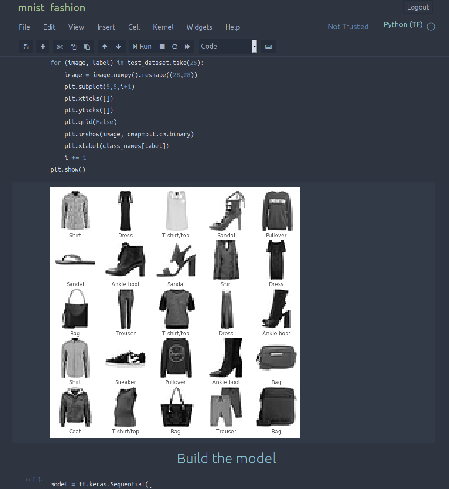

# Nord-Jupyter

Nord Theme for Jupyter.

Checkout their github: https://github.com/arcticicestudio/nord

Simply copy-paste the custom.css in the `~/.jupyter/custom` folder. This should do the trick. Beware of the font used in the css file, and change it to your liking.

